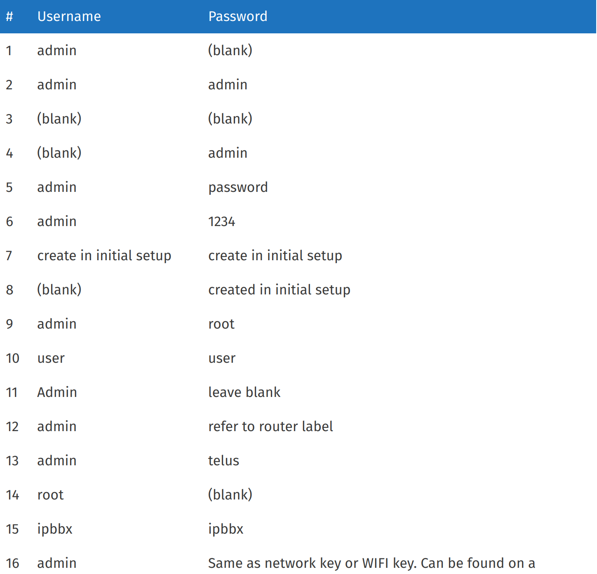

# Свято место пусто не бывает: Write-up

Домашние беспроводные точки доступа знамениты тем, что мало кто грамотно их настраивает.

Если перейти по ссылке — увидим страницу авторизации для некоего устройства DIR-825ACG1. Домашние беспроводные точки доступа также знамениты тем, что неприлично часто их оставляют со стандартными логином и паролем. Попробуем нагуглить:



Пробуем все варианты, начиная с первого: логин `admin`, пароль пустой. Увы, домашние беспроводные точки доступа ещё и знамениты тем, что качество их программного обеспечения оставляет желать лучшего: веб-страница убеждена, что свято место (поле ввода пароля) пусто не бывает (хотя на самом деле бывает, конечно):

```html
<input name="password" required="">
```

Уберём атрибут `required` и попробуем-таки войти с пустым паролем. Получилось, видим таблицу с подключёнными клиентами, название одного из которых начинается с `ugra_`...

Флаг: **ugra_unless_it_is_not_really_that_sacred_000bded066ad72dd**
